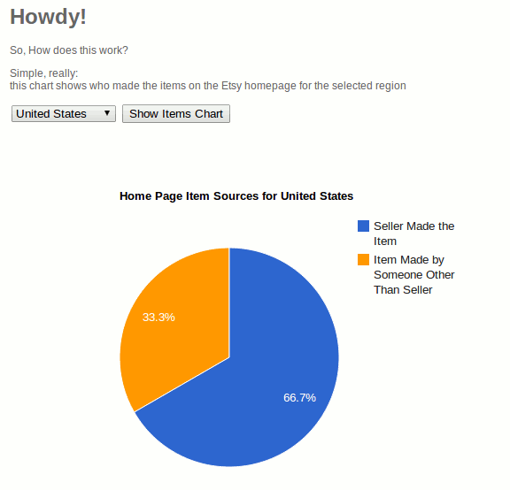

Etsy API / Google Visualization API Mashup

This Spring Java app queries the featured listings on the Etsy Home Page through the Etsy API.
The results are tabulated to provide a summary of where the items are sourced (made by the seller, made by the seller's group, or made by someone else).
These results are displayed in a Pie Chart thanks to the Google Visualization API.

 
currently [lives](http://morning-spire-9667.herokuapp.com/) on Heroku

notes: 
you will need to enter your own Etsy API key in servlet-context.xml
app is packaged for build with maven and run in Jetty runner
